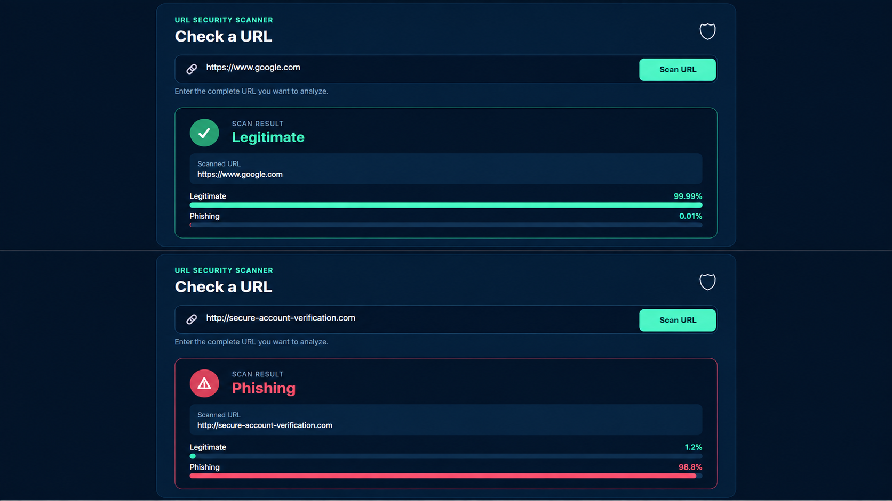

# 🛡️ PhishGuard

A machine learning based web application that detects whether a URL is potentially **phishing** or **legitimate**.

PhishGuard analyzes URL character patterns using a trained machine learning model and provides a prediction with probability estimates through a Flask web application.

---

## 🚀 Features

- Detects potentially phishing URLs
- Character-level URL analysis
- Machine learning based classification
- Legitimate and phishing probability estimates
- URL validation
- Real-time prediction through a web interface
- Responsive cybersecurity-themed UI

---

## 🧠 Machine Learning

The project uses:

- **TF-IDF Vectorization**
- **Character-level n-grams**
- **Logistic Regression**

Instead of manually extracting URL features, the model learns patterns directly from the characters present in URLs.

### Model Performance

The model was evaluated on a held-out test set.

| Metric | Score |
|---|---:|
| Accuracy | 98.01% |
| Precision | 97.82% |
| Recall | 98.12% |
| F1 Score | 97.97% |

---

## 🛠️ Technologies Used

### Backend
- Python
- Flask

### Machine Learning
- Scikit-learn
- Pandas
- TF-IDF
- Logistic Regression

### Frontend
- HTML
- CSS
- JavaScript

### Tools
- Git
- GitHub

---

## 📂 Project Structure

```text
phishing-url-detector/
│
├── data/
│   └── real_urls.csv
│
├── model/
│   └── phishing_model.pkl
│
├── src/
│   └── train_model.py
│
├── templates/
│   └── index.html
│
├── static/
│   ├── style.css
│   └── script.js
│
├── app.py
├── README.md
└── requirements.txt

## 🔍 How It Works
## 🖥️ Application Screenshots

### URL Detection

